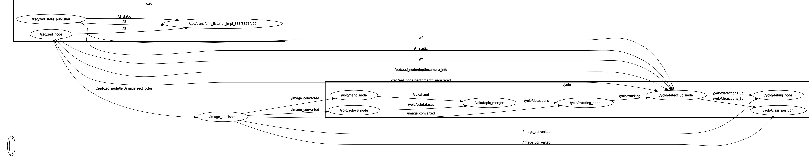
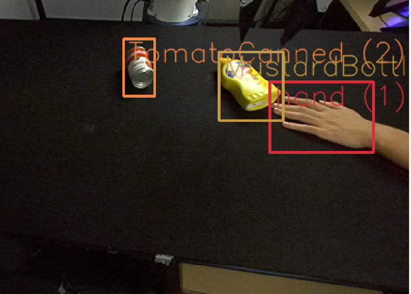
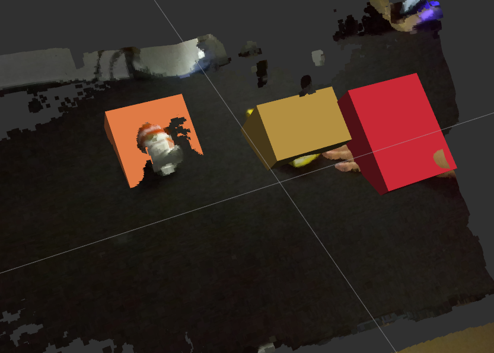
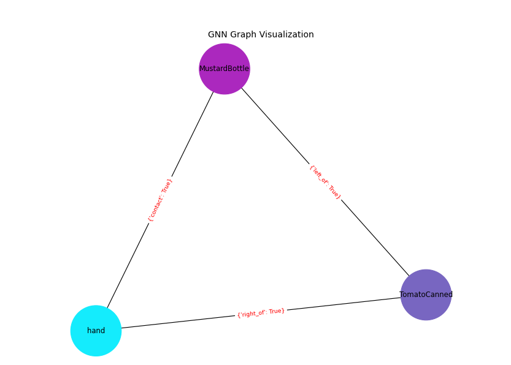

# **3d_scene_graphs**
This project provides a ROS 2 wrapper based on Ultralytics YOLOv8 and the ZED 2 depth camera, enabling real-time object detection, tracking, instance segmentation, human pose estimation, and Oriented Bounding Box (OBB) functionality. Additionally, it supports 3D object detection using depth images, incorporating the ability to assess static and dynamic spatial relationships between objects and generate segmented visual representations of these relationships.

## Table of Contents
1. Installation
2. Models
3. Usage

## Installation
This package depends on the Ubuntu Humble version. We are using the ZED 2 depth camera by default, so please ensure that the [zed-ros2-wrapper package](https://github.com/stereolabs/zed-ros2-wrapper) is installed before running the following programs.
```bash
cd ~/ros2_ws/src
git clone https://github.com/weilinhan/3dscenegraphs.git
cd ~/3d_scene_graphs
pip3 install -r yolov8_ros/requirements.txt
cd ~/ros2_ws
rosdep install --from-paths src --ignore-src -r -y
colcon build
```

## Models
We have trained models the handycb.pt model for hand detection and using YOLOv8 on a subset of the YCB dataset, resulting in the ycblab.pt model for object detection. Of course, you can also train your own custom dataset and replace the corresponding models in the `~/yolov8_ros/yolov8_bringup/launch/yolov8_3d.launch` file.

## Usage
First, we need to launch the camera node.
```bash
cd ~/3d_scene_graphs
ros2 launch zed_wrapper zed_camera.launch.py camera_model:=zed2
```
Since the ZED2 camera sends image data in the bgra8 format by default, we need to change the data format to bgr8 in order to use it with YOLO.
```bash
cd ~/fake_camera/fake_camera
python image_publisher.py
```
Launch the package.
```bash
cd ~/3d_scene_graphs
ros2 launch yolov8_bringup yolov8_3d.launch.py input_image_topic:=/image_converted image_reliability:=1 input_depth_topic:=/zed/zed_node/depth/depth_registered input_depth_info_topic:=/zed/zed_node/depth/camera_info depth_image_reliability:=1 depth_info_reliability:=1 target_frame:=zed_left_camera_optical_frame
```

### Topics
- **image_publisher**: Receive image data in bgra8 format from the ZED 2 camera and convert the image to bgr8 format for output.
- **/yolo/hand_node**: Hands detected by YOLO using the RGB images. 
- **/yolo/yolov8_node**: Objects detected by YOLO using the RGB images. Each object contains a bounding boxes and a class name. It may also include a mak or a list of keypoints.
- **/yolo/topic_merger**: Combine the information from hand detection and object detection and publish it, allowing the detection boxes for hands and objects to overlap.
- **/yolo/detections**: Objects detected by YOLO using the RGB images. Each object contains a bounding boxes and a class name. It may also include a mak or a list of keypoints.
- **/yolo/detections_3d**: 3D objects detected. YOLO results are used to crop the depth images to create the 3D bounding boxes and 3D keypoints.
- **/yolo/debug_image**: Debug images showing the detected and tracked objects. They can be visualized with rviz2.
- **/yolo/class_position**: The coordinate system has been corrected to better align with real-world coordinate relationships. It is used to determine the static and dynamic relationships between detected objects and can also render graphical primitives.

### Parameters

- **model_type**: Ultralytics model type (default: YOLO)
- **model**: YOLOv8 model (default: yolov8m.pt)
- **tracker**: tracker file (default: bytetrack.yaml)
- **device**: GPU/CUDA (default: cuda:0)
- **enable**: wether to start YOLOv8 enabled (default: True)
- **threshold**: detection threshold (default: 0.5)
- **input_image_topic**: camera topic of RGB images (default: /camera/rgb/image_raw)
- **image_reliability**: reliability for the image topic: 0=system default, 1=Reliable, 2=Best Effort (default: 2)
- **input_depth_topic**: camera topic of depth images (default: /camera/depth/image_raw)
- **depth_image_reliability**: reliability for the depth image topic: 0=system default, 1=Reliable, 2=Best Effort (default: 2)
- **input_depth_info_topic**: camera topic for info data (default: /camera/depth/camera_info)
- **depth_info_reliability**: reliability for the depth info topic: 0=system default, 1=Reliable, 2=Best Effort (default: 2)
- **depth_image_units_divisor**: divisor to convert the depth image into metres (default: 1000)
- **target_frame**: frame to transform the 3D boxes (default: base_link)
- **maximum_detection_threshold**: maximum detection threshold in the z axis (default: 0.3)

## Demo
After running the above code, we will get the following image in RViz2, and the positional relationships between the detected objects will be displayed as text information in the terminal.



To visualize the graphical primitives, in `~/yolov8_ros/class_position.py` remove the comment from the line `#plt.figure(figsize=(10, 8))` and replace it with the following code: `plt.figure(figsize=(10, 8))`

